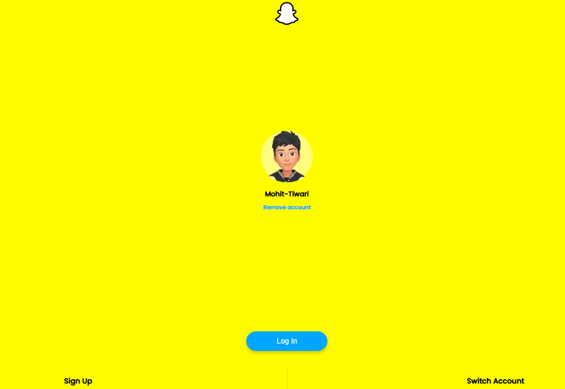

# snapchat
 

  

A fully responsive Snapchat Login Page Clone built with HTML, CSS, and JavaScript. This project mimics the look and feel of the official Snapchat login interface, providing a stylish user experience for login and signup simulations.

✨ Features

✅ Fully responsive design

✅ Clean and minimal UI inspired by Snapchat

✅ Login form with email/username & password fields

✅ Eye-catching background or hero section

✅ Dark/light mode 

✅ Form validation with JavaScript

✅ Stylish hover & focus effects

✅ Mobile-first layout

### Techstack
 ! !    
